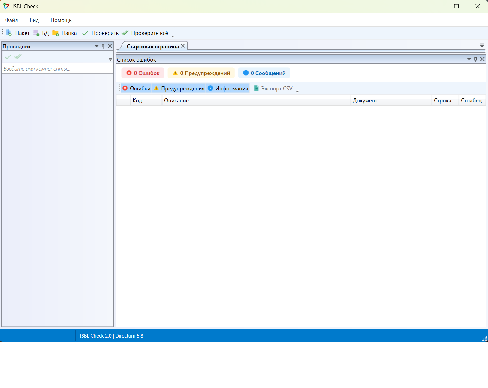

# ISBL Check — Статический анализатор ISBL-кода

Инструмент для анализа ISBL кода, который служит для выявления ошибок в коде на стадии разработки. По сути является статическим анализатором кода.

**Версия 2.6.0** — Исправление багов анализатора и очистка



## Быстрое начало

### Скачивание готовой сборки

Если вы не хотите компилировать проект самостоятельно, скачайте готовую сборку:

1. Перейдите в раздел [Releases](https://github.com/Jhonny-2005/IsblCheck/releases)
2. Скачайте файл `IsblCheck-v2.6.0.zip` из последнего релиза
3. Распакуйте архив в любую папку
4. Запустите `IsblCheck.exe`

### Системные требования

* Windows 7 / Server 2008 R2 или новее
* .NET Framework 4.5
* Подключение к базе данных Directum (для проверки разработки из БД)

## Возможности

* Загрузка разработки из базы данных Directum
* Загрузка разработки из пакетов разработки (ISX-файлы)
* Загрузка разработки из папки с разработкой (утилита DTU)
* Отображение результатов проверки с подсветкой ошибок в коде
* Сохранение отчета о проверке в файл (CSV, Excel)
* Консольный агент для проверки в невизуальном режиме

## Категории ошибок

| Категория | Описание |
|-----------|----------|
| **ERROR** | Возможные Runtime ошибки |
| **WARNING** | Проверки на неоптимальный код |
| **INFO** | Прочие проверки |

## Правила проверки

### Правила функций (F-коды)

| Код | Описание |
|-----|----------|
| F001 | Неверное количество параметров функции |
| F003 | Использование несуществующей строки локализации |
| F005/F021/F022 | Некорректный формат строки |
| F007 | Не указан класс исключения |
| F012 | Функция слишком длинная |
| F015 | Пустой блок catch |
| F016 | Глубокая вложенность |
| F017 | Нарушение транзакционной безопасности |
| F018 | Одиночный аргумент форматирования |
| F019 | Функция без справки |
| F020 | Поглощенные исключения |
| F023 | Безусловный выход из цикла for |
| F024 | Отсутствие обработки ошибок в событиях |
| F025 | Использование устаревших функций ISBL |
| F026 | Утечка соединений |
| F027 | Слишком много параметров |
| F028 | Недостижимый код после ExitFor |
| F029 | Бесконечный цикл (While True без Exit) |
| F030 | Вложенные транзакции |
| F031 | Несбалансированные ExceptionsOff/ExceptionsOn |
| F032 | Магические числа |
| F033 | Некорректное использование оператора == |
| F034 | Тихое поглощение исключений (try/except с FreeException) |
| F035 | Путаница nil/NULL в сравнениях |
| F036 | Использование устаревших переменных в событиях |
| F037 | Асимметричный ExceptionsOff в ветвлениях |
| F038 | Интерактивные окна в серверных/workflow событиях |
| F039 | Магические строки (хардкод идентификаторов) |
| J006 | Использование интерактивных окон в событиях справочников |

### Правила переменных (A-коды)

| Код | Описание |
|-----|----------|
| A001 | Использование переменной без инициализации |
| A002 | Использование переменной с переопределением |
| A003 | Неиспользуемая переменная |
| A005 | Присваивание переменной самой себе |

### Правила логических выражений (B-коды)

| Код | Описание |
|-----|----------|
| B003 | Использование ключевых слов True/False |

### Правила объектной модели (I-коды)

| Код | Описание |
|-----|----------|
| I001 | Объект не восстанавливает свое состояние |
| I013 | Использование свойства Info.Reference |

### Правила безопасности (S-коды)

| Код | Описание |
|-----|----------|
| S001 | Возможная SQL-инъекция через конкатенацию строк |
| S002 | Захардкоженные учётные данные |
| S003 | Небезопасная конкатенация SQL |
| S004 | Запуск внешних программ в серверных событиях |
| S005 | Запись в реестр в серверных событиях |

### Прочие правила

| Код | Описание |
|-----|----------|
| M001 | Комментарии TODO/DONE |

## Что нового в v2.6.0

* Исправлен SilentExceptionSwallowRule (F034) — неверный индекс дочернего элемента
* Исправлен TransactionSafetyRule (F017) — добавлена проверка вне Try-блоков
* Исправлен InteractiveModeCheckRule (F047) — корректный сброс флага
* Исправлен WebRuntimeContextCheckRule (F048) — корректный сброс флага
* Удалены дублирующие правила: UnsafeSQLConcatRule (S001), StringComparisonMisuseRule (F033)
* Исправлены опечатки и мелкие баги в правилах
* Удалены устаревшие zip файлы
* Обновлены версии в инсталляторах (2.5.0.0 → 2.6.0.0)

## Что нового в v2.5.0

* Удалено некорректное правило B003 (True/False — стандартные константы ISBL)
* Добавлено 6 новых правил на основе документации Directum:
  * F047: Обращение к форме без проверки InteractiveMode()
  * F048: Десктопные функции без проверки IsWebRuntimeContext()
  * F049: ShowMessage/MessageBox в отчетах
  * F050: Строковые операторы сравнения для чисел
  * F051: Открытие больших справочников на сервере
  * F052: Рекомендация именованных исключений для повторных попыток
* Обновлены версии в инсталляторах (2.4.0.0 → 2.5.0.0)

## Что нового в v2.4.0

* Добавлено 8 новых правил проверки:
  * F040: ExceptionsOff вне блока Try/Except
  * F041: Next/Reset внутри foreach
  * F042: CreateConnection без Try/Except
  * F043: Exit() в критических событиях
  * F044: Sleep/Пауза в серверных событиях
  * F045: Try/Finally без Except
  * F046: Пропуск обязательных параметров
  * S006: Execute/Выполнить в серверных событиях
* Исправлен .gitignore (корректное игнорирование Artifacts/obj/, bin/)
* Удалены устаревшие файлы (IsblCheck-v2.3.0.zip, логи)
* Обновлены версии в инсталляторах (2.3.0.0 → 2.4.0.0)

## Что нового в v2.3.0

* Исправлена критическая ошибка компиляции UnreachableCodeRule (ссылки на несуществующие StatementContext)
* Удалены устаревшие файлы (IsblCheck-v2.0.0.zip, nuget.exe)
* Обновлены версии в инсталляторах (1.0.0.0 → 2.3.0.0)
* Обновлены ссылки на скачивание в README
* Исключены промежуточные файлы сборки (Artifacts/obj/, bin/) из отслеживания git

## Что нового в v2.2.0

* Исправлена недостижимая ветка в UnreachableCodeRule (не существующий ExitStatementContext)
* Исправлен off-by-one в UnconditionalExitForRule (GetChild(3) → GetChild(4))
* Добавлена проверка финального баланса в ExceptionsOffBalanceRule
* Исправлены коды в 3 тестах (B003, I013, A005)
* Добавлено 8 новых правил проверки:
  * F033: Некорректное использование оператора ==
  * F034: Тихое поглощение исключений
  * F035: Путаница nil/NULL
  * F036: Устаревшие переменные событий
  * F037: Асимметричный ExceptionsOff
  * F038: Интерактивные окна в workflow
  * F039: Магические строки
  * S005: Запись в реестр

## Что нового в v2.1.0

* Исправлены дублирования кодов правил (F004, F018, F019)
* Добавлено 6 новых правил проверки
* Улучшены тесты (добавлены позитивные и граничные тесты)
* Обновлена документация

## Directum 5.8: Что нового

* Обновлены системные функции ISBL для работы с Directum 5.8
* Добавлены интерфейсы для работы с почтой (IMailFactory, IMailServer, IMessage)
* Добавлены интерфейсы для серверных событий (IServerEvent, IServerEventFactory)
* Добавлены интерфейсы для глобальных ИД (IGlobalIDFactory, IGlobalIDInfo)
* Добавлены интерфейсы для процессов (IProcess, IProcessFactory, IProcessMessage)
* Добавлены новые типы управления (IPanelGroup, IInnerPanel, IBitButton)
* Добавлены новые значения TISBLContext для папок и процессов
* Добавлены новые предопределенные переменные (CurrentPeriod, Process, ProcessMessage, WorkTree)

## Структура проекта

```
IsblCheck/
├── src/
│   ├── IsblCheck/                    # GUI приложение (WPF)
│   ├── IsblCheck.Agent/              # Консольный агент
│   ├── IsblCheck.Core/               # Ядро анализатора
│   ├── IsblCheck.BaseRules/          # Базовые правила проверки
│   ├── IsblCheck.BaseRules.Tests/    # Тесты правил
│   ├── IsblCheck.Context.Application/ # Контекст приложения Directum
│   ├── IsblCheck.Context.Development/ # Контекст разработки
│   └── IsblCheck.Reports/            # Формирование отчетов
├── Artifacts/                        # Готовая сборка (Release)
├── installer/                        # Проекты инсталляторов
└── IsblCheck.sln                     # Файл решения
```

## Сборка из исходников

### Установка необходимого ПО

* Visual Studio 2017 или новее
* [Расширение Antlr](https://visualstudiogallery.msdn.microsoft.com/25b991db-befd-441b-b23b-bb5f8d07ee9f)
* [Расширение SlowCheetah](https://github.com/Microsoft/slow-cheetah)
* [JRE](http://www.oracle.com/technetwork/java/javase/downloads/index.html)

Для сборки инсталляторов:
* WiX Toolset v3
* Расширение WiX для Visual Studio

### Порядок сборки

1. Скачать проект через Git:
   ```
   git clone https://github.com/Jhonny-2005/IsblCheck.git
   ```
2. Открыть решение `IsblCheck.sln` в Visual Studio
3. Восстановить зависимости решения через NuGet
4. Выполнить сборку решения (Build → Rebuild Solution)

## Использование

### GUI версия

1. Запустите `IsblCheck.exe`
2. Нажмите "Добавить базу данных" для подключения к Directum
3. Выберите компоненты для проверки
4. Нажмите "Проверить"
5. Результаты отобразятся в окне отчета

### Консольный агент

```bash
IsblCheck.Agent.exe
```

Агент загружает настройки из `IsblCheck.Agent.exe.config` и выполняет проверку в фоновом режиме.

## Лицензия

MIT License

## Авторы

* [DIRECTUM](https://github.com/DirectumCompany) — оригинальный проект
* [Jhonny-2005](https://github.com/Jhonny-2005) — форк с тестами и релизом
